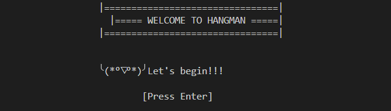
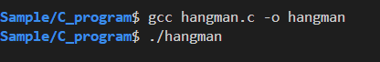
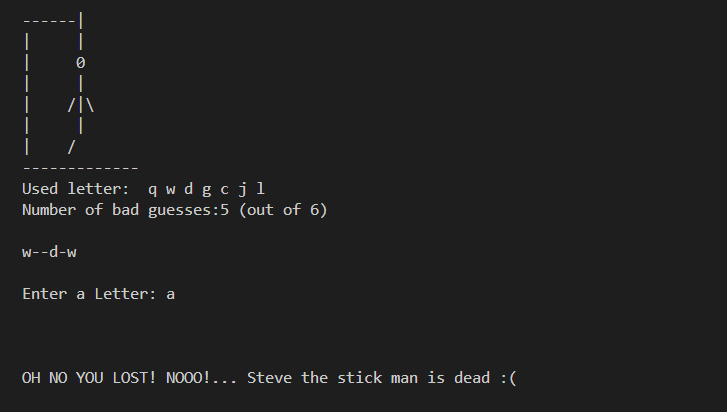

# 🎮 Hangman Game (C Implementation)

This is a classic **Hangman** game written in C.
The objective of the game is to guess the hidden word before the stick figure ("Steve") is completely drawn.

You’ll choose a difficulty level (Easy, Medium, or Hard), and the game will randomly select a word from the corresponding word list file.

---

## 📦 Requirements

- C compiler (e.g., `gcc`, `clang`, or MSVC)
- Word list files (provided in repository)Make sure the following files are present in the same directory as the program before running it:
  - `easy.txt`
  - `medium.txt`
  - `hard.txt`

Each file should contain one word per line.

---

## ⚙️ Compilation & Execution
(**NOTE:** Using your terminal of course) 
- To compile the program:

```bash
gcc hangman.c -o hangman
```

- To run the game:

```bash
./hangman
```



---

## 🕹️ How to Play

1. The program will randomly select a word from the difficulty level you choose.

2. Guess letters one at a time.

    * Correct letters will be revealed in their positions.

    * Wrong guesses will progressively draw the hangman.

5. You lose if you make 6 wrong guesses.

6. You win if you guess the full word before the hangman is completed.

7. At the end of a game, you’ll be asked if you want to play again.

