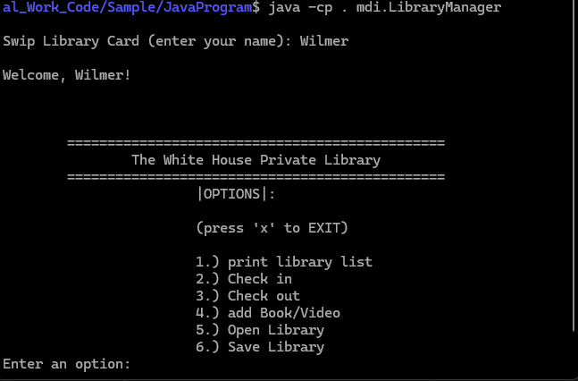
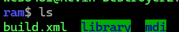
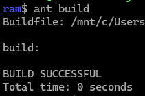
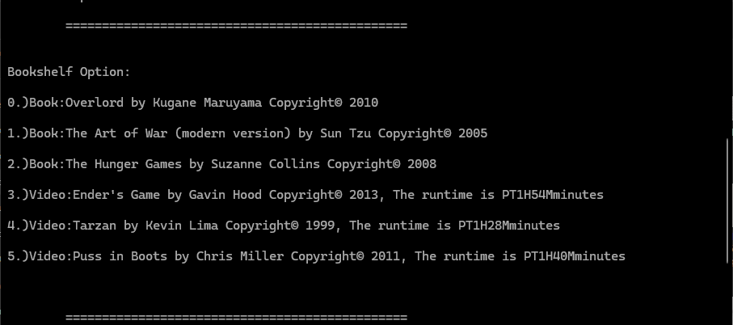

# Library Management System 📚📼



*This is a simple **Library Management System** built in Java. It allows you to:
- Track publications (books and videos)
- Check out 
- Store and retrieve resource information via file I/O
- Extend functionality using object-oriented principles

This project uses standard Java features (no external dependencies) and builds via **Apache Ant**.

---

## 📁 Project Structure
   ````text
JavaProgram/
            ├── build.xml # Ant build script
            ├── mdi/
            │ └── LibraryManager.java # Main class with main() method
            ├── library/
            │ ├── Publication.java # Shared superclass for all media
            │ ├── Video.java # Video-specific class
            │ └── library.java # manages the books/videos
  ````

---

## 🧑‍💻 How to Compile and Run

### ✅ Recommended (Cross-platform) — Using Ant

**Step 1: Build the project**
```bash
  ant build
```


**Step 2: Run the main program**
```bash
  java -cp . mdi.LibraryManager
```
## or
⚠️ Linux Shortcut (Not portable)
On some versions of Linux, you can run the program like this:
```bash
  java mdi/LibraryManager
```




🛠 Alternative — Manual Compile & Run
If you prefer not to use Ant:

Step 1: Compile all .java files

```bash
javac mdi/LibraryManager.java
```
This will also compile dependencies from the library/ package automatically.

Step 2: Run the program

```bash
java -cp . mdi.LibraryManager
```

---

## 📚 Generate JavaDoc (Optional)
If you want to generate the API documentation:
```bash
  ant javadoc
```
This will generate documentation in: docs/api/index.html

---

##🧹 Clean the Build
To delete all .class files and documentation:
```bash
  ant clean
```
---
## Summary:
OOP & Java Fundamentals Showcase
This project is a fully encapsulated Java library management system that reflects my understanding and practical implementation of Object-Oriented Programming (OOP) principles.
Through carefully designed class hierarchies, modular code, and robust error handling, I demonstrate how Java’s OOP features can be used to model real-world systems such as:

* Use inheritance and polymorphism for flexibility and extensibility

* Protect and structure data using encapsulation

* Simplify complexity through abstraction

* Handle real-world errors using custom exceptions

* Persist and restore object state using file I/O

* Automate builds and generate professional documentation

In short, it shows not only that I know how to write Java code—but that I can design robust, extensible, and maintainable object-oriented systems with a clear grasp of core software engineering principles.
